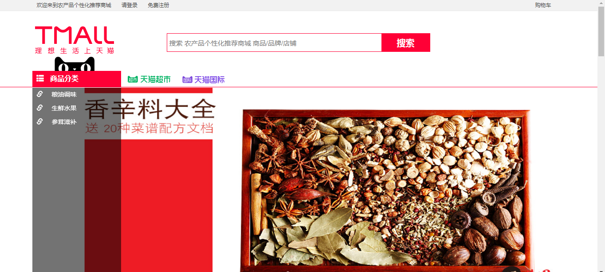
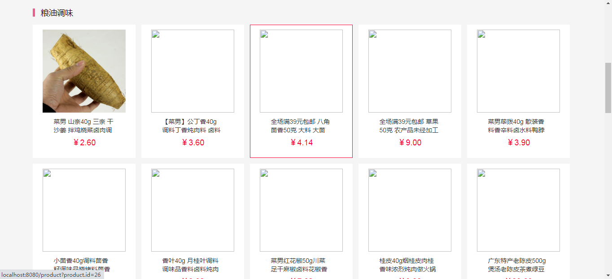
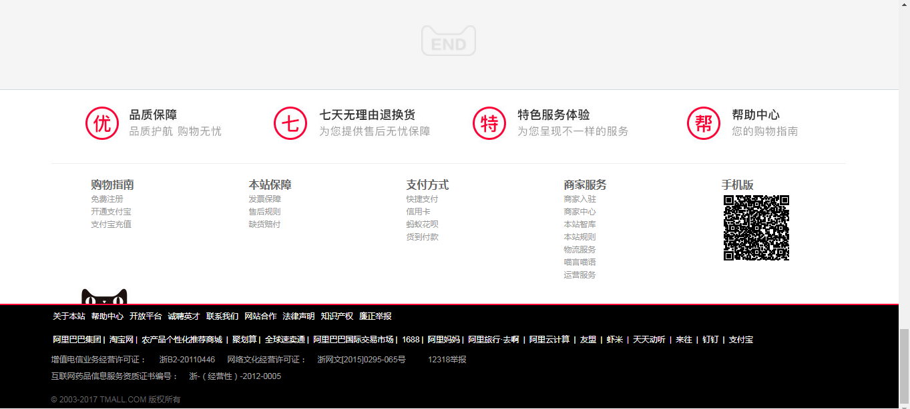
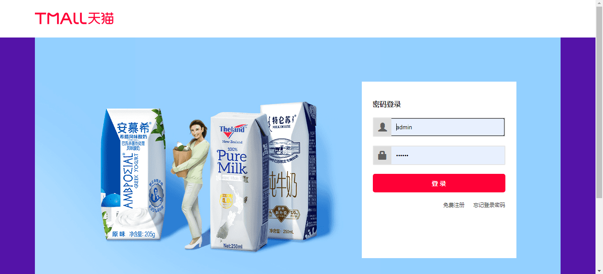
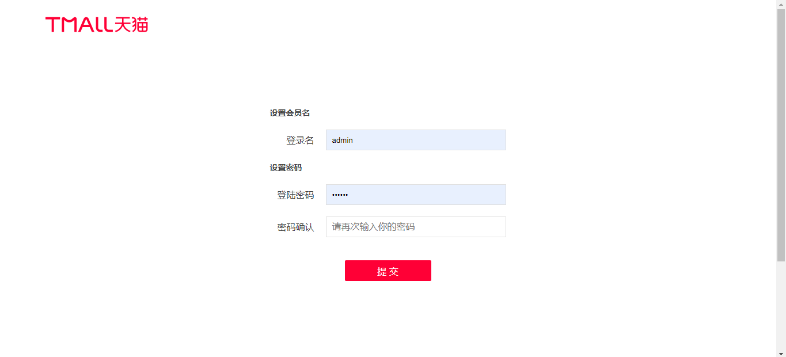
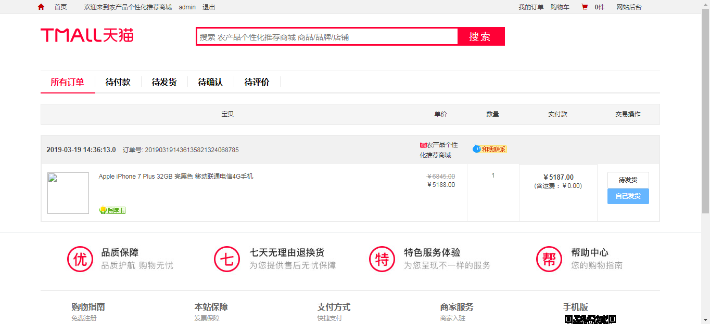
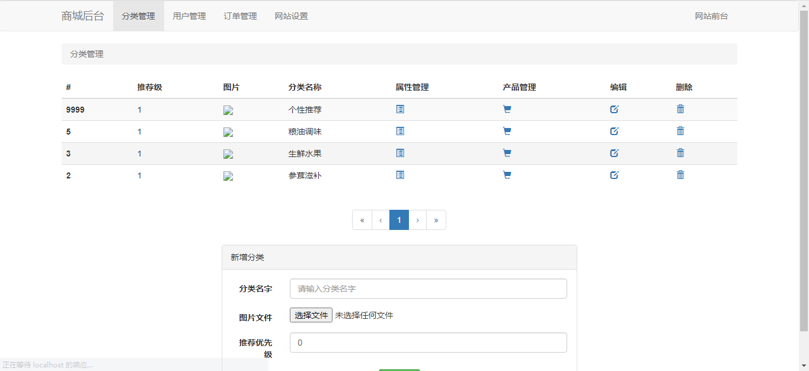
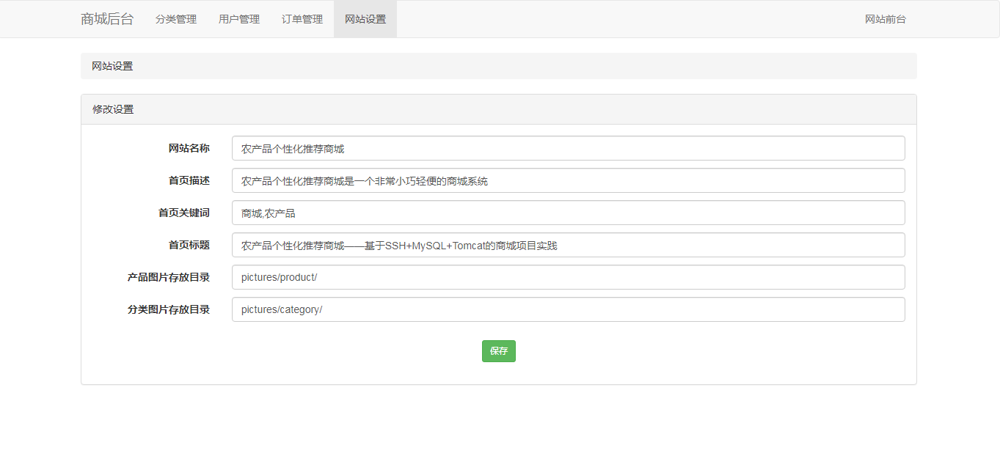

<h1 align="center">天猫商城管理系统</h1>

## 简介
天猫商城管理系统：角色分为管理员、用户；系统提供商品管理、订单管理、用户管理、分类管理、网站设置、注册登录功能，支持多样化商品展示和后台管理操作。    --计算机毕业设计源码；毕设源码；java毕业设计源码

## 联系方式

<h3 align="center">获取完整代码与数据库文件 + 微信：bysj5151 QQ: 86050149 QQ群: 783742310</h3>

<h3 align="center">可帮忙远程部署 包运行成功！提供远程部署、修改代码、设计文档指导、代码讲解等服务！</h3>

## 功能介绍（完整见运行截图）
管理员：基本功能包括登录、注册和退出系统，能够通过界面管理商品的分类、信息添加、编辑和删除。此外，可以处理用户订单，并管理用户信息和权限设置。支持数据统计和分析，帮助理解销售趋势和用户行为。网站设置功能允许修改基本信息，如网站名称和描述，并设置图片存放目录，确保网站前后台信息一致性。

用户：用户通过系统进行注册和登录后，可以通过搜索栏、导航栏和商品分类菜单，浏览并搜索商品。功能包括查看商品列表、查看商品详情、添加商品至购物车和进行订单结算。用户个人中心提供信息查看与修改功能，包括查看订单状态、管理收货地址和收藏夹。购物保障、售后服务和多样化的支付选项支持用户在购买和售后过程中的需求。

## 运行截图

本代码来源于网络,仅供学习参考使用!

